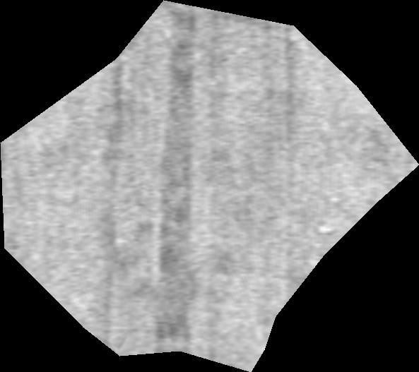

# Segmata
------------------------
This software is in link with Vesuvius project [scrollprize.org](https://scrollprize.org/).
Segmata is a program that allows users to optimize segmentation from Khartes, https://github.com/KhartesViewer/khartes.
For rendering layers it uses: vesuvius-render from https://github.com/jrudolph/vesuvius-gui
It is written in Python.

The main emphasis of Segmata is to automatically perform modifications on .obj file in order to improve the segmentation in terms of:
- Visual rendering of layers
- Inference result on segment (in a future step)

The .obj modifications are done on individual vertex displacements along normals (loop over all vertex). This displacement is limited to 2 pixels (adjustable).
Several loops are possible.
The cost function for deciding is the modified point is better can be based on:
- Maximize bright pixels count (the papyrus layer is brighter than "holes")
- Minimize dark pixel count or dark contours area (decrease "holes" or dark zones in papyrus)
Tha actual version uses:
- Difference with previous image if np.mean(image_diff)>0 we keep the changes

## Workflow


## Example
1. Create a simple fragment in Khartes
See example for files.


Original image using vesuvius_render:


2. Launch segmata

Result at first pass:


Result at second pass:



Result at third pass:


A log file is created in order to follow the optimization steps, hereafter are the results:
[segmata_log file](example/segmata_log.txt)

## Limits

The method used implies that rendering must be the same size before and after a vertex modification.
Is not the comparison will be false.
This point is not too restrictive because we change only one vertex at a time.


## Installation

Required installation: Khartes and vesuvius-render

## Usage
See [code file](code/optimizer_4.py)
```
# Exemple d'utilisation
obj_file_path = "C:\\Vesuvius\\segment_test\\"
obj_filename = "segment_test.obj"
renderer_path = r"C:\\Vesuvius\\vesuvius-render-v34-x86_64-pc-windows-msvc.exe"
output_image_path = r"C:\\Vesuvius\\segment_test\\32.jpg"
image_reference = r"C:\\Vesuvius\\segment_test\\32.jpg_ref.jpg"
log_path = os.path.join(obj_file_path, "segmata_log.txt")
if os.path.exists(log_path):
    os.remove(log_path)

render_arguments = [
    "--obj", os.path.join(obj_file_path, "temp_" + obj_filename),
    "--width", "593",
    "--height", "527",
    "--target-dir", obj_file_path,
    "-v", "20241024131838",
    "--min-layer", "32",
    "--max-layer", "32",
    "--target-format", "jpg",
    "--data-directory", "C:\\Vesuvius"
]

log_print(log_path,"****************************")
log_print(log_path,"  OPTIMIZATION START")
log_print(log_path,"****************************")
for pass_number in range(3):
    log_print(log_path,f"PASS {pass_number+1}")
    segmata(log_path,obj_file_path, obj_filename, renderer_path, render_arguments, output_image_path, image_reference, 2,pass_number)
    log_print(log_path,"****************************")

display_result(output_image_path,image_reference)
```

Adjusting the parameters
"--width", "xxx", "--height", "xxx", must be adjusted as per info in json file (exported from Khartes), at least proportional to.
"-v", "20241024131838", must be adjusted accordingly to scroll volume (the example is for Scroll5 PHerc172)
