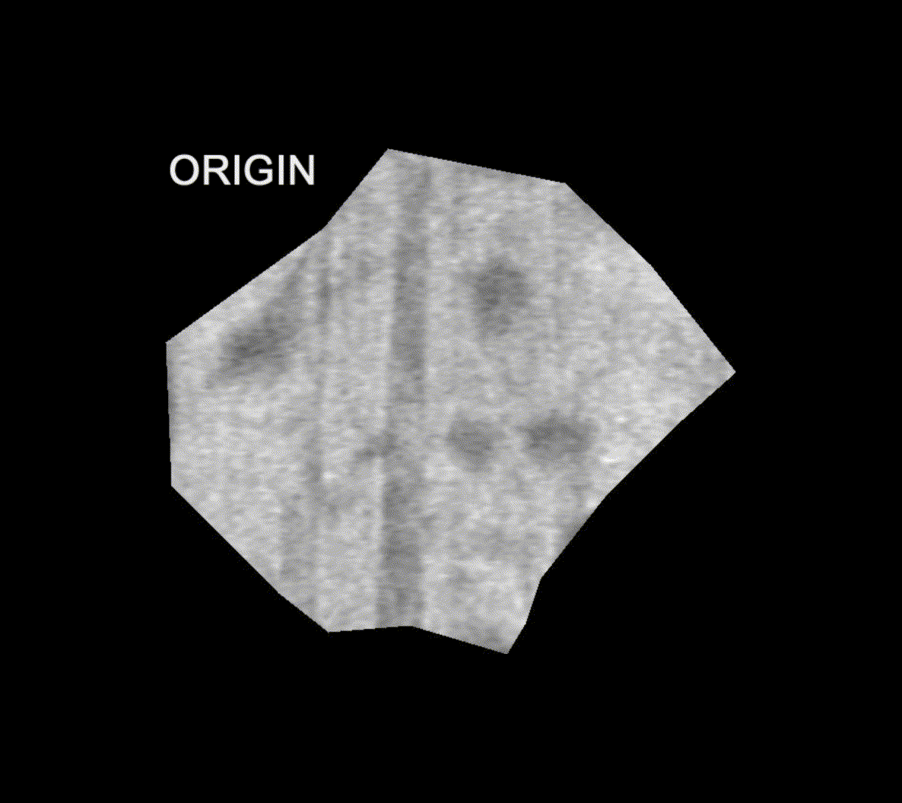

# Segmata - it's like uncrease a papyrus sheet...
------------------------
This software is in link with Vesuvius project [scrollprize.org](https://scrollprize.org/).

Segmata is a program that allows users to optimize segmentation from Khartes, https://github.com/KhartesViewer/khartes.

For rendering layers it uses: vesuvius-render from https://github.com/jrudolph/vesuvius-gui

It is written in Python.


The main emphasis of Segmata is to automatically perform modifications on .obj file in order to improve the segmentation in terms of:
- Visual rendering of layers
- Inference result on segment (in a future step)

The .obj modifications are done on individual vertex displacements along normals (loop over all vertex). This displacement is limited to 2 pixels (adjustable).

Several passes are possible.

The cost function for deciding is the modified point is better can be based on:
- Maximize bright pixels count (the papyrus layer is brighter than "holes")
- Minimize dark pixel count or dark contours area (decrease "holes" or dark zones in papyrus)

Tha actual version uses:
- Difference with previous image if np.mean(image_diff)>0 we keep the changes

**In a second step you can render more layers and apply a composite filter to several layers.
This can improve the ink detection/labelling thanks to a better visualization of papyrus surface.**


## Workflow


INPUT: .obj file (exported from Khartes)

OUTPUT: .obj file (optimized)


## Example on a small segment (only 74 vertex)
1. Create a simple fragment in Khartes

See example for files.


2. Launch segmata

Result pass after pass:



A log file is created in order to follow the optimization steps, hereafter are the results:
[segmata_log file](example/segmata_log.txt)

3. Import the new created obj file and compare the difference using Khartes.


Difference between red (optimized version) and blue (original file) line is cleary visible !

The red line is following the papyrus sheet closer. 


## Example 2 on bigger segment 20241207134906 (4119 vertex)
Area= 0.75cm²

Optimization result:


## Example 3 on segment 20241108120730 (official segment)
Area= 3.2cm²

Optimization result:

See how "holes" are well eliminated and filled with papyrus sheet.

**But also how ink is appearing more clearly.**


## Limits

The method used implies that rendering must be the same size before and after a vertex modification.
Is not the comparison will be false.

This point is not too restrictive because we change only one vertex at a time.


## Installation

Required installation:
- Khartes
- vesuvius-render

- Seems to have some issues with subprocess.run command when using an environment like Spyder (working on Thonny, IDLE Python,...)

## Usage
See [code file](code/optimization_20241207134906.py)
```
#----------------------------------------------
# Segmata
#----------------------------------------------
#
# main function
#
# version 04.04.2025
# S.Gouttebroze
#----------------------------------------------

import os
import utils

# Example
obj_file_path = "C:\\Vesuvius\\20241207134906\\"
obj_filename = "20241207134906.obj"
renderer_path = r"C:\\Vesuvius\\vesuvius-render-v34-x86_64-pc-windows-msvc.exe"
output_image_path = r"C:\\Vesuvius\\20241207134906\\32.jpg"
image_reference = r"C:\\Vesuvius\\20241207134906\\32.jpg_ref.jpg"
log_path = os.path.join(obj_file_path, "segmata_log.txt")
if os.path.exists(log_path): os.remove(log_path)

render_arguments = [
    "--obj", os.path.join(obj_file_path, "temp_" + obj_filename),
    "--width", "2159",
    "--height", "684",
    "--target-dir", obj_file_path,
    "-v", "20241024131838",
    "--min-layer", "32",
    "--max-layer", "32",
    "--target-format", "jpg",
    "--data-directory", "C:\\Vesuvius"]

utils.log_print(log_path,"****************************")
utils.log_print(log_path,"  OPTIMIZATION START")
utils.log_print(log_path,"****************************")
for pass_number in range(3):
    utils.log_print(log_path,f"PASS {pass_number+1}")
    utils.segmata(log_path,obj_file_path, obj_filename, renderer_path, render_arguments, output_image_path, image_reference, 2,pass_number)
    utils.log_print(log_path,"****************************")

utils.display_result(output_image_path,image_reference)
```

Adjusting the parameters

"--width", "xxx", "--height", "xxx", must be manually adjusted as per info in json file (exported from Khartes), at least proportional to.

"-v", "20241024131838", must be adjusted accordingly to scroll volume (the example is for Scroll5 PHerc172)

 ## Khartes integration 

  - it improves treatment speed
  - interactivly view the results

Link to a demo video:
 [demo khartes integration](https://github.com/sgoutteb/segmata/blob/b52449f4d5eeedb8fa6f8a44c7465e6736428bdf/khartes_integration/%CF%87%CE%AC%CF%81%CF%84%CE%B7%CF%82%20-%20khartes_projet_segmata.mp4)

## Further developments

- **Improve speed of treatment**
  - work in memory, but how to deal with vesuvius-render ?
  - try villa//scroll-renderer/
  - work one vertex out of x instead of all
- **Automatic detection of width and height**
  - Reading json file exported by Khartes

- **Implementation of inference**
- **Add user interface for choosing folders and files**
